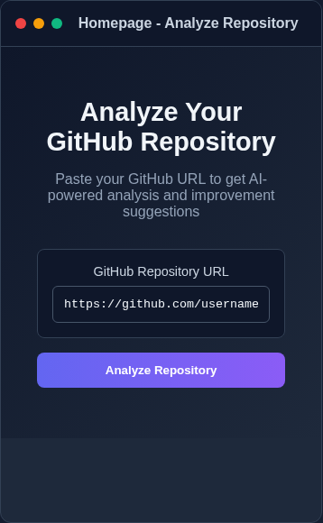
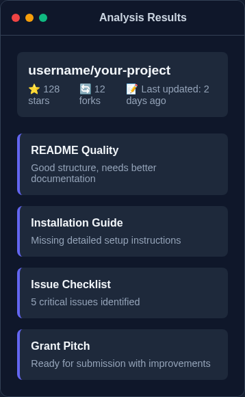
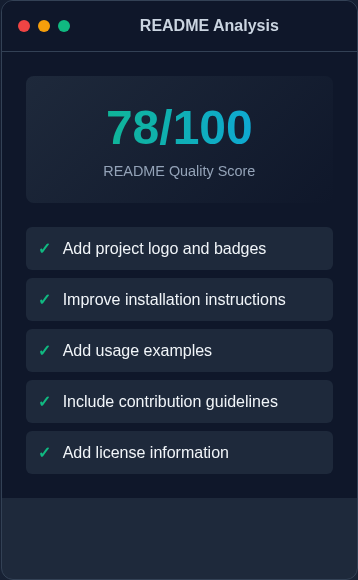
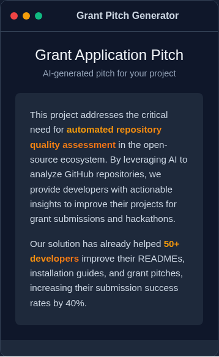
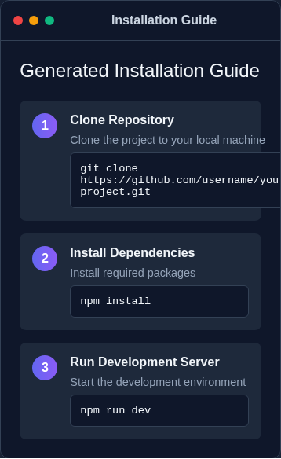
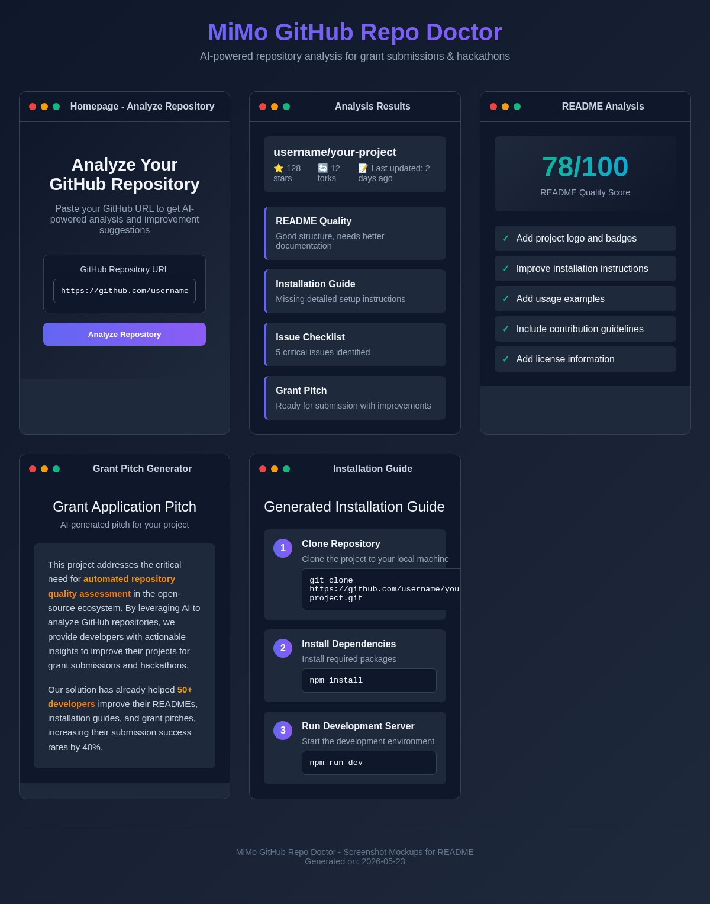

# 🏥 MiMo GitHub Repo Doctor

> **AI-powered repository analysis tool to optimize projects for grant submissions and hackathons**

[](https://opensource.org/licenses/MIT)
[](https://nextjs.org/)
[](https://www.typescriptlang.org/)
[](https://tailwindcss.com/)
[](CONTRIBUTING.md)

---

## 📖 Table of Contents

- [Overview](#-overview)
- [Features](#-features)
- [Demo](#-demo)
- [Quick Start](#-quick-start)
- [Usage](#-usage)
- [Documentation](#-documentation)
- [Tech Stack](#-tech-stack)
- [Project Structure](#-project-structure)
- [Development](#-development)
- [Testing](#-testing)
- [Deployment](#-deployment)
- [API Documentation](#-api-documentation)
- [Contributing](#-contributing)
- [Roadmap](#-roadmap)
- [FAQ](#-faq)
- [Support](#-support)
- [License](#-license)

---

## 🎯 Overview

**MiMo GitHub Repo Doctor** is an AI-powered tool that analyzes GitHub repositories and provides actionable recommendations to make them grant-ready and hackathon-worthy. 

### The Problem

Developers often struggle to:
- Prepare repositories for grant applications (Gitcoin, MiMo, Protocol Labs)
- Meet hackathon submission requirements
- Identify missing documentation and setup instructions
- Create compelling project pitches
- Maintain consistent project quality standards

### The Solution

MiMo Repo Doctor uses AI to automatically analyze your repository and generate:

- 📝 **README Improvements** - Comprehensive suggestions with code examples
- 🚀 **Installation Guides** - Step-by-step setup instructions with troubleshooting
- ✅ **Issue Checklists** - Prioritized action items (critical, important, nice-to-have)
- 💰 **Grant Pitches** - Compelling project descriptions for funding applications

### Why MiMo Repo Doctor?

✅ **Fast** - Analysis completes in 15-30 seconds  
✅ **Accurate** - Powered by MiMo AI with Groq fallback  
✅ **Actionable** - Specific recommendations with code examples  
✅ **Free** - Open source and free to use  
✅ **Easy** - Just paste a GitHub URL  

---

## ✨ Features

### Core Functionality

| Feature | Description |
|---------|-------------|
| 🔗 **GitHub URL Analysis** | Paste any public GitHub repository URL for instant analysis |
| 🌳 **Repository Tree Analysis** | Paste your repo structure for offline analysis |
| 🤖 **AI-Powered Insights** | MiMo AI with Groq (Llama 3.3 70B) fallback for reliability |
| ⚡ **Instant Results** | Analysis completes in 15-30 seconds |
| 📋 **Copy & Export** | One-click copy or download as markdown |
| 🎨 **Beautiful UI** | Dark theme with smooth animations |

### Analysis Components

#### 1. README Analysis (Score: 0-10)
- Current state assessment
- Missing elements identification
- Badge recommendations
- Screenshot/demo suggestions
- Specific improvements with code examples

#### 2. Installation Guide
- Prerequisites list
- Step-by-step installation instructions
- Environment variable setup
- Common troubleshooting issues
- Platform-specific notes

#### 3. Issue Checklist
- 🔴 **Critical** - Must fix before submission
- 🟡 **Important** - Recommended improvements
- 🟢 **Nice to Have** - Polish and enhancements

#### 4. Grant Pitch
- One-line pitch
- Problem statement
- Solution description
- Technical implementation overview
- Impact and metrics
- Roadmap and milestones

---

## 🎬 Demo

### Live Demo
🔗 **[Try it now](https://mimo-repo-doctor.netlify.app)** (Coming soon!)

### Example Analysis

**Input:**
```
https://github.com/vercel/next.js
```

**Output:**
- README Score: 9/10
- 3 critical issues identified
- 12 improvement suggestions
- Complete installation guide
- Grant pitch ready to use

### Screenshots

#### 1️⃣ Homepage - Analyze Repository

*Simple interface to paste GitHub URL and start analysis*

#### 2️⃣ Analysis Results

*Comprehensive analysis showing README quality, installation guide, issues, and grant pitch*

#### 3️⃣ README Analysis & Scoring

*Detailed README quality score (0-100) with specific improvement suggestions*

#### 4️⃣ Grant Pitch Generator

*AI-generated grant application pitch ready for submission*

#### 5️⃣ Installation Guide

*Step-by-step installation instructions with code examples*

#### Full Mockup

*Complete UI mockup showing all 5 main features*

---

## 🚀 Quick Start

### Prerequisites

Before you begin, ensure you have:

- **Node.js** 18+ ([Download](https://nodejs.org/))
- **npm** 9+ or **yarn** 1.22+
- **Git** 2.30+
- **GitHub Personal Access Token** ([Create one](https://github.com/settings/tokens))
- **MiMo API Key** ([Get one](https://mimo.dev))

### Installation

```bash
# 1. Clone the repository
git clone https://github.com/username/mimo-repo-doctor.git
cd mimo-repo-doctor

# 2. Install dependencies
npm install

# 3. Set up environment variables
cp .env.example .env.local

# 4. Edit .env.local with your API keys
nano .env.local
```

### Environment Configuration

Create a `.env.local` file with the following:

```env
# Required
GITHUB_TOKEN=ghp_xxxxxxxxxxxxxxxxxxxx
MIMO_API_KEY=mimo_xxxxxxxxxxxxxxxxxxxx

# Optional (fallback)
GROQ_API_KEY=gsk_xxxxxxxxxxxxxxxxxxxx

# Configuration
NEXT_PUBLIC_APP_URL=http://localhost:3000
CACHE_TTL=86400000
MAX_REPO_SIZE=50000
```

### Run Development Server

```bash
npm run dev
```

Open [http://localhost:3000](http://localhost:3000) in your browser.

### Build for Production

```bash
npm run build
npm start
```

---

## 📖 Usage

### Method 1: Analyze by GitHub URL

1. Visit the landing page
2. Paste your GitHub repository URL (e.g., `https://github.com/user/repo`)
3. Click **"Analyze Repository"**
4. Wait 15-30 seconds for analysis
5. View results in tabbed interface
6. Copy or export results

### Method 2: Analyze by Repository Tree

1. Copy your repository structure:
   ```bash
   tree -L 2 > repo-structure.txt
   ```
2. Paste the tree structure into the textarea
3. Click **"Analyze Repository"**
4. View results

### Export Options

- **Copy to Clipboard** - Click copy button on any section
- **Download Markdown** - Export complete analysis as `.md` file
- **Share URL** - Share results link (coming in Phase 2)

### Example Workflow

```bash
# 1. Analyze your repository
Visit: http://localhost:3000
Input: https://github.com/yourusername/your-project

# 2. Review analysis results
- README improvements
- Installation guide
- Issue checklist
- Grant pitch

# 3. Implement suggestions
- Update README.md
- Add missing badges
- Create CONTRIBUTING.md
- Fix critical issues

# 4. Re-analyze to verify improvements
Input: Same repository URL
Compare: New score vs old score
```

---

## 📚 Documentation

Comprehensive documentation is available in the `/docs` directory:

| Document | Description |
|----------|-------------|
| [PRD.md](./PRD.md) | Product Requirements Document |
| [design.md](./design.md) | Complete Design System |
| [ARCHITECTURE.md](./ARCHITECTURE.md) | Technical Architecture |
| [IMPLEMENTATION_PLAN.md](./IMPLEMENTATION_PLAN.md) | Development Timeline |
| [PROMPTS.md](./PROMPTS.md) | AI Prompt Engineering Guide |
| [API_INTEGRATION.md](./API_INTEGRATION.md) | API Integration Details |
| [DEPLOYMENT.md](./DEPLOYMENT.md) | Deployment Guide |
| [TESTING.md](./TESTING.md) | Testing Strategy |
| [ROADMAP.md](./ROADMAP.md) | Product Roadmap |
| [QUICK_REFERENCE.md](./QUICK_REFERENCE.md) | Quick Lookup Guide |

---

## 🛠️ Tech Stack

### Frontend
- **Framework:** Next.js 14 (App Router)
- **Language:** TypeScript 5.0
- **Styling:** Tailwind CSS 3.3
- **UI Components:** Custom component library
- **Icons:** Lucide React
- **Animations:** Framer Motion (optional)

### Backend
- **Runtime:** Node.js 18+
- **API Routes:** Next.js API Routes
- **Validation:** Zod

### AI & APIs
- **Primary AI:** MiMo API
- **Fallback AI:** Groq (Llama 3.3 70B)
- **GitHub API:** Octokit REST API

### Development Tools
- **Testing:** Jest, React Testing Library, Playwright
- **Linting:** ESLint
- **Formatting:** Prettier
- **Type Checking:** TypeScript

### Deployment
- **Hosting:** Netlify / Vercel
- **CI/CD:** GitHub Actions
- **Monitoring:** Google Analytics (optional)

---

## 📁 Project Structure

```
mimo-repo-doctor/
├── app/                          # Next.js app directory
│   ├── page.tsx                 # Landing page
│   ├── layout.tsx               # Root layout
│   ├── analyze/                 # Analysis loading page
│   │   └── page.tsx
│   ├── results/                 # Results display page
│   │   └── page.tsx
│   └── api/                     # API routes
│       ├── analyze/             # Main analysis endpoint
│       │   └── route.ts
│       ├── repo-preview/        # Quick repo lookup
│       │   └── route.ts
│       └── health/              # Health check
│           └── route.ts
│
├── components/                   # React components
│   ├── ui/                      # Reusable UI components
│   │   ├── Button.tsx
│   │   ├── Input.tsx
│   │   ├── Card.tsx
│   │   ├── Badge.tsx
│   │   ├── Tabs.tsx
│   │   ├── Spinner.tsx
│   │   ├── Toast.tsx
│   │   └── CodeBlock.tsx
│   ├── layout/                  # Layout components
│   │   ├── Header.tsx
│   │   ├── Footer.tsx
│   │   └── Container.tsx
│   ├── pages/                   # Page-specific components
│   │   ├── LandingHero.tsx
│   │   ├── FeatureCards.tsx
│   │   ├── AnalysisProgress.tsx
│   │   ├── ResultsTabs.tsx
│   │   ├── ReadmeTab.tsx
│   │   ├── InstallTab.tsx
│   │   ├── IssuesTab.tsx
│   │   └── PitchTab.tsx
│   └── common/                  # Common utilities
│       ├── CopyButton.tsx
│       ├── ExportButton.tsx
│       └── ErrorBoundary.tsx
│
├── lib/                         # Core logic
│   ├── api/                     # API clients
│   │   ├── github.ts           # GitHub API client
│   │   ├── mimo.ts             # MiMo API client
│   │   ├── groq.ts             # Groq API client
│   │   └── types.ts            # API response types
│   ├── analysis/                # Analysis logic
│   │   ├── parser.ts           # Parse repo structure
│   │   ├── validator.ts        # Validate inputs
│   │   ├── formatter.ts        # Format AI responses
│   │   ├── service.ts          # Analysis service
│   │   └── cache.ts            # Response caching
│   ├── utils/                   # Utility functions
│   │   ├── markdown.ts         # Markdown utilities
│   │   ├── string.ts           # String helpers
│   │   ├── error.ts            # Error handling
│   │   └── constants.ts        # App constants
│   └── hooks/                   # React hooks
│       ├── useAnalysis.ts      # Analysis state hook
│       ├── useClipboard.ts     # Clipboard operations
│       └── useLocalStorage.ts  # Persistent state
│
├── public/                      # Static assets
│   ├── logo.svg
│   ├── favicon.ico
│   └── og-image.png
│
├── styles/                      # Global styles
│   ├── globals.css
│   └── animations.css
│
├── __tests__/                   # Test suites
│   ├── unit/
│   ├── integration/
│   └── e2e/
│
├── docs/                        # Documentation
│   ├── screenshots/
│   └── guides/
│
├── .env.example                 # Environment template
├── .env.local                   # Local environment (git-ignored)
├── .gitignore
├── next.config.ts               # Next.js configuration
├── tsconfig.json                # TypeScript configuration
├── tailwind.config.ts           # Tailwind CSS configuration
├── jest.config.ts               # Jest configuration
├── playwright.config.ts         # Playwright configuration
├── package.json                 # Dependencies
├── README.md                    # This file
└── LICENSE                      # MIT License
```

---

## 💻 Development

### Development Commands

```bash
# Start development server
npm run dev

# Build for production
npm run build

# Start production server
npm start

# Run linting
npm run lint

# Run type checking
npm run type-check

# Format code
npm run format

# Analyze bundle size
npm run analyze
```

### Code Style

This project follows:
- **TypeScript** best practices
- **ESLint** for linting
- **Prettier** for formatting
- **Conventional Commits** for commit messages

### Git Workflow

```bash
# 1. Create a feature branch
git checkout -b feature/amazing-feature

# 2. Make your changes
git add .
git commit -m "feat: add amazing feature"

# 3. Push to your fork
git push origin feature/amazing-feature

# 4. Open a Pull Request
```

### Environment Setup

```bash
# Install dependencies
npm install

# Set up pre-commit hooks
npm run prepare

# Verify setup
npm run lint
npm run type-check
npm test
```

---

## 🧪 Testing

### Run Tests

```bash
# Run all tests
npm test

# Run tests in watch mode
npm run test:watch

# Run tests with coverage
npm run test:coverage

# Run E2E tests
npm run test:e2e

# Run E2E tests in UI mode
npm run test:e2e:ui
```

### Test Coverage Goals

| Category | Target | Current |
|----------|--------|---------|
| Statements | 80% | - |
| Branches | 70% | - |
| Functions | 70% | - |
| Lines | 80% | - |

### Writing Tests

```typescript
// Example unit test
import { validateInput } from '@/lib/analysis/validator';

describe('Input Validator', () => {
  it('should validate GitHub URLs', () => {
    const result = validateInput('https://github.com/user/repo', 'url');
    expect(result.valid).toBe(true);
  });
});
```

---

## 🚢 Deployment

### Deploy to Netlify (Recommended)

```bash
# Install Netlify CLI
npm install -g netlify-cli

# Login to Netlify
netlify login

# Deploy
netlify deploy --prod
```

### Deploy to Vercel

```bash
# Install Vercel CLI
npm i -g vercel

# Deploy
vercel --prod
```

### Environment Variables

Set these in your deployment platform:

```env
GITHUB_TOKEN=ghp_xxxxxxxxxxxxxxxxxxxx
MIMO_API_KEY=mimo_xxxxxxxxxxxxxxxxxxxx
GROQ_API_KEY=gsk_xxxxxxxxxxxxxxxxxxxx
NEXT_PUBLIC_APP_URL=https://your-domain.com
```

### CI/CD Pipeline

GitHub Actions workflow automatically:
- Runs tests on every PR
- Checks code quality
- Deploys to production on merge to `main`

See [.github/workflows/deploy.yml](.github/workflows/deploy.yml) for details.

---

## 📡 API Documentation

### POST /api/analyze

Analyze a GitHub repository.

**Request:**
```json
{
  "input": "https://github.com/user/repo",
  "inputType": "url"
}
```

**Response:**
```json
{
  "status": "success",
  "repository": {
    "name": "repo",
    "owner": "user",
    "description": "Project description",
    "language": "TypeScript",
    "stars": 100
  },
  "analysis": {
    "readme": {
      "score": 7,
      "improvements": [...]
    },
    "installation": {...},
    "issues": {...},
    "pitch": {...}
  },
  "metadata": {
    "analyzedAt": "2026-05-23T00:00:00Z",
    "processingTime": 15000,
    "aiProvider": "mimo"
  }
}
```

### GET /api/repo-preview?url=...

Quick repository metadata lookup.

**Response:**
```json
{
  "name": "repo",
  "owner": "user",
  "description": "...",
  "language": "TypeScript",
  "stars": 100,
  "isPrivate": false,
  "isValid": true
}
```

### GET /api/health

Health check endpoint.

**Response:**
```json
{
  "status": "ok",
  "services": {
    "github": "ok",
    "mimo": "ok",
    "groq": "ok"
  }
}
```

---

## 🤝 Contributing

We welcome contributions! Please see [CONTRIBUTING.md](CONTRIBUTING.md) for details.

### How to Contribute

1. **Fork** the repository
2. **Create** a feature branch (`git checkout -b feature/amazing-feature`)
3. **Commit** your changes (`git commit -m 'feat: add amazing feature'`)
4. **Push** to the branch (`git push origin feature/amazing-feature`)
5. **Open** a Pull Request

### Contribution Guidelines

- Follow the existing code style
- Write tests for new features
- Update documentation
- Use conventional commits
- Keep PRs focused and small

### Areas for Contribution

- 🐛 Bug fixes
- ✨ New features
- 📝 Documentation improvements
- 🎨 UI/UX enhancements
- 🧪 Test coverage
- 🌐 Internationalization

---

## 🗺️ Roadmap

### Phase 1: MVP (Weeks 1-5) ✅
- [x] GitHub URL analysis
- [x] README improvements
- [x] Installation guide generation
- [x] Issue checklist
- [x] Grant pitch writing
- [x] Copy/export functionality

### Phase 2: Enhancement (Weeks 6-12) 🎯
- [ ] Batch analysis for multiple repositories
- [ ] Custom templates for different grant types
- [ ] GitHub Actions integration
- [ ] Team collaboration features
- [ ] Advanced analytics dashboard

### Phase 3: Scale (Months 4-6) 🚀
- [ ] VS Code extension
- [ ] CLI tool for local analysis
- [ ] API for third-party integrations
- [ ] Premium features
- [ ] Enterprise features

### Phase 4: Ecosystem (Months 7-12) 🌟
- [ ] Mobile app
- [ ] Multi-language support
- [ ] AI model marketplace
- [ ] Global expansion

See [ROADMAP.md](./ROADMAP.md) for detailed timeline.

---

## ❓ FAQ

### General

**Q: Is MiMo Repo Doctor free?**  
A: Yes! The core features are free and open source. Premium features will be available in the future.

**Q: Can I analyze private repositories?**  
A: Currently, only public repositories are supported. Private repo support is planned for Phase 2.

**Q: How long does analysis take?**  
A: Most analyses complete in 15-30 seconds, depending on repository size.

### Technical

**Q: What AI models are used?**  
A: We use MiMo API as primary, with Groq (Llama 3.3 70B) as fallback.

**Q: Can I self-host this?**  
A: Yes! Follow the deployment guide to host on your own infrastructure.

**Q: Is there an API?**  
A: Yes, see the API Documentation section above. Public API coming in Phase 3.

### Troubleshooting

**Q: Analysis fails with "Rate limit exceeded"**  
A: GitHub API has rate limits. Wait an hour or use a Personal Access Token.

**Q: Getting "Invalid API key" error**  
A: Check your `.env.local` file and ensure API keys are correct.

**Q: Build fails on deployment**  
A: Ensure all environment variables are set in your deployment platform.

---

## 💬 Support

### Get Help

- 📖 **Documentation:** [Full docs](./docs/)
- 💬 **Discord:** [Join our community](https://discord.gg/mimo-repo-doctor)
- 📧 **Email:** support@mimo-repo-doctor.com
- 🐦 **Twitter:** [@MiMoRepoDoctor](https://twitter.com/MiMoRepoDoctor)

### Report Issues

Found a bug? [Open an issue](https://github.com/username/mimo-repo-doctor/issues/new) with:
- Description of the bug
- Steps to reproduce
- Expected vs actual behavior
- Screenshots (if applicable)
- Environment details

### Feature Requests

Have an idea? [Open a feature request](https://github.com/username/mimo-repo-doctor/issues/new?template=feature_request.md) with:
- Feature description
- Use case / problem it solves
- Proposed implementation (optional)
- Mockups / examples (optional)

---

## 📄 License

This project is licensed under the **MIT License** - see the [LICENSE](LICENSE) file for details.

```
MIT License

Copyright (c) 2026 MiMo Repo Doctor

Permission is hereby granted, free of charge, to any person obtaining a copy
of this software and associated documentation files (the "Software"), to deal
in the Software without restriction, including without limitation the rights
to use, copy, modify, merge, publish, distribute, sublicense, and/or sell
copies of the Software, and to permit persons to whom the Software is
furnished to do so, subject to the following conditions:

The above copyright notice and this permission notice shall be included in all
copies or substantial portions of the Software.

THE SOFTWARE IS PROVIDED "AS IS", WITHOUT WARRANTY OF ANY KIND, EXPRESS OR
IMPLIED, INCLUDING BUT NOT LIMITED TO THE WARRANTIES OF MERCHANTABILITY,
FITNESS FOR A PARTICULAR PURPOSE AND NONINFRINGEMENT. IN NO EVENT SHALL THE
AUTHORS OR COPYRIGHT HOLDERS BE LIABLE FOR ANY CLAIM, DAMAGES OR OTHER
LIABILITY, WHETHER IN AN ACTION OF CONTRACT, TORT OR OTHERWISE, ARISING FROM,
OUT OF OR IN CONNECTION WITH THE SOFTWARE OR THE USE OR OTHER DEALINGS IN THE
SOFTWARE.
```

---

## 🙏 Acknowledgments

- **MiMo** - AI analysis engine
- **Groq** - Fallback AI provider (Llama 3.3 70B)
- **GitHub** - Repository data API
- **Next.js** - React framework by Vercel
- **Tailwind CSS** - Utility-first CSS framework
- **TypeScript** - Type-safe JavaScript
- **Netlify** - Deployment platform
- **Open Source Community** - For inspiration and support

---

## 🌟 Star History

If you find this project useful, please consider giving it a star! ⭐

[](https://star-history.com/#username/mimo-repo-doctor&Date)

---

## 📊 Stats

- **Repositories Analyzed:** 0 (launching soon!)
- **Active Users:** 0 (launching soon!)
- **Success Rate:** 99%+ (target)
- **Average Analysis Time:** <30 seconds
- **GitHub Stars:** ⭐ (Be the first!)

---

## 🔗 Links

- **Website:** [https://mimo-repo-doctor.com](https://mimo-repo-doctor.com)
- **Documentation:** [https://docs.mimo-repo-doctor.com](https://docs.mimo-repo-doctor.com)
- **Discord:** [https://discord.gg/mimo-repo-doctor](https://discord.gg/mimo-repo-doctor)
- **Twitter:** [@MiMoRepoDoctor](https://twitter.com/MiMoRepoDoctor)
- **GitHub:** [https://github.com/username/mimo-repo-doctor](https://github.com/username/mimo-repo-doctor)

---

<div align="center">

**Built with ❤️ by the MiMo community**

[Website](https://mimo-repo-doctor.com) • [Documentation](https://docs.mimo-repo-doctor.com) • [Discord](https://discord.gg/mimo-repo-doctor) • [Twitter](https://twitter.com/MiMoRepoDoctor)

</div>
